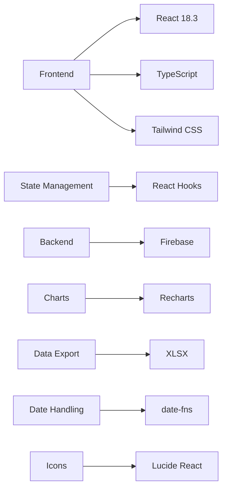
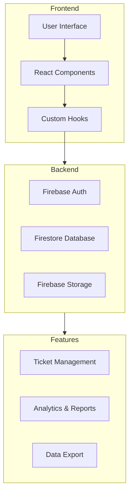
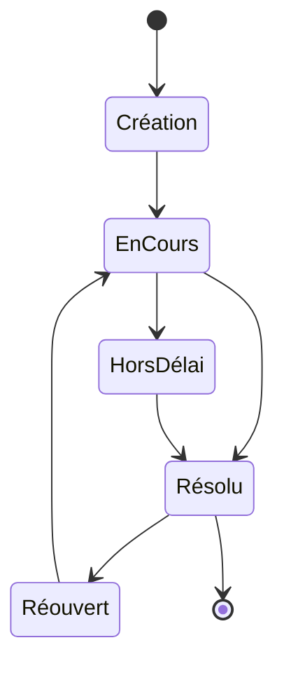
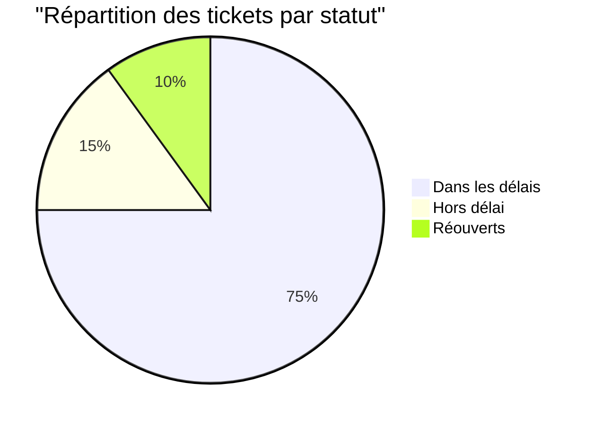
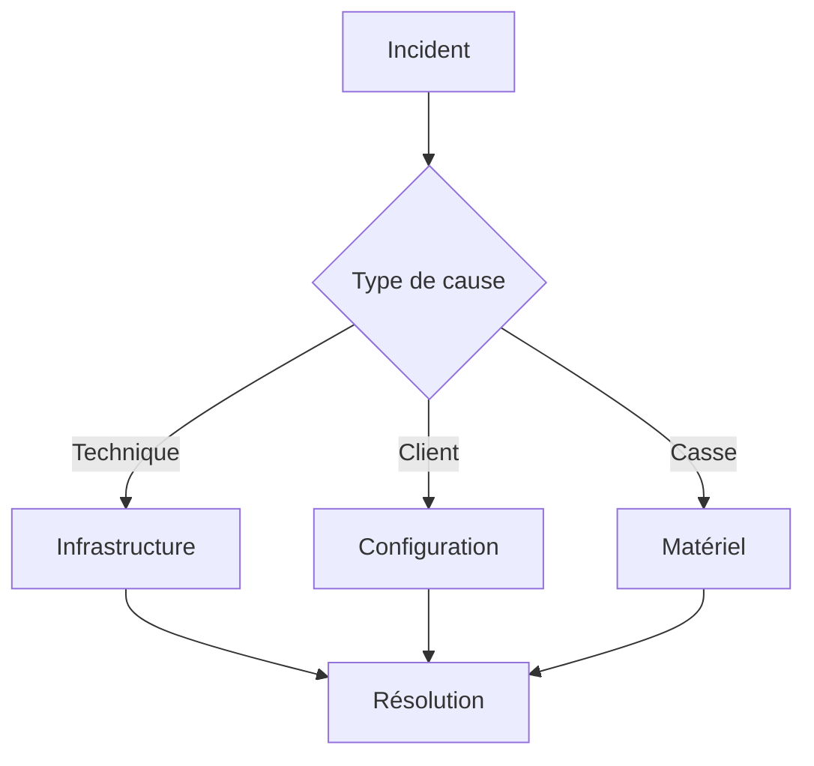
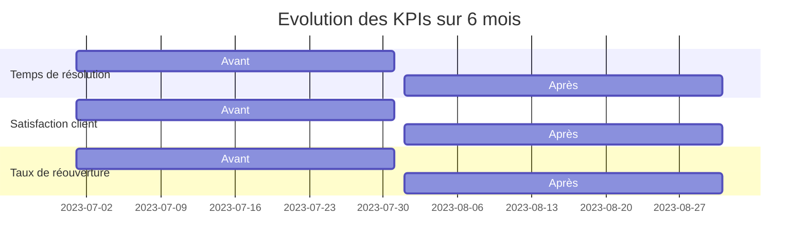
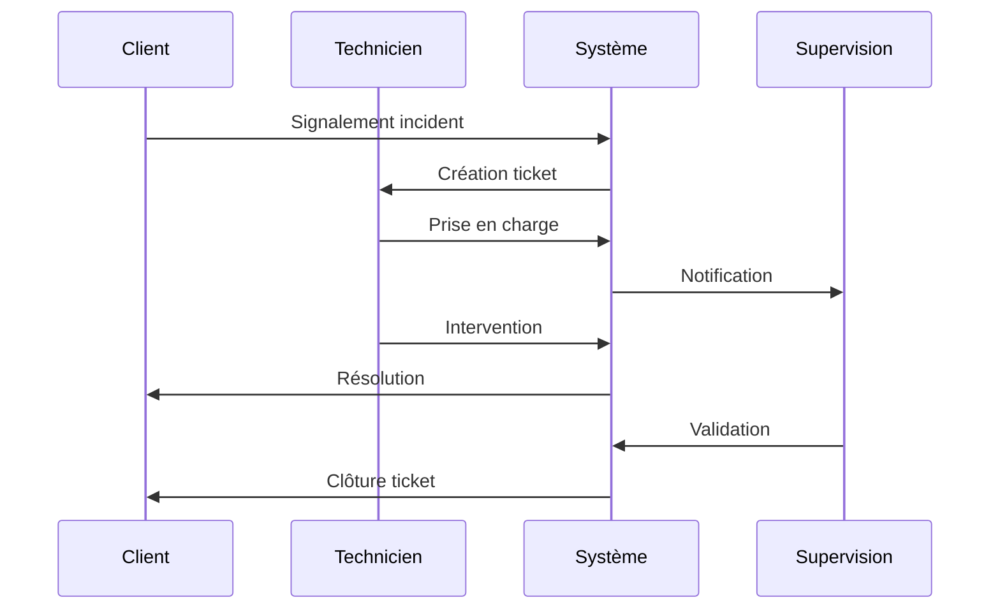

# Suivi des Tickets SAV TAROUDANT - Documentation

## 📋 Table des matières

1. [Vue d'ensemble](#vue-densemble)
2. [Technologies utilisées](#technologies-utilisées)
3. [Architecture](#architecture)
4. [Fonctionnalités principales](#fonctionnalités-principales)
5. [Impact sur la qualité de service](#impact-sur-la-qualité-de-service)
6. [Guide d'utilisation](#guide-dutilisation)
7. [Workflow](#workflow)

## Vue d'ensemble

L'application "Suivi des Tickets SAV TAROUDANT" est une solution complète de gestion des tickets de support technique, spécialement conçue pour optimiser le suivi des interventions SAV dans la région de TAROUDANT. Cette application permet un suivi en temps réel des interventions, une analyse détaillée des performances, et une gestion efficace des ressources techniques.

### Objectifs principaux

- Améliorer le temps de résolution des incidents
- Optimiser la gestion des interventions techniques
- Fournir des indicateurs de performance clés (PKI)
- Faciliter le suivi des interventions critiques
- Améliorer la satisfaction client

## Technologies utilisées

### Stack technique détaillé

- **Frontend Framework**: React 18.3
- **Language**: TypeScript
- **Styling**: Tailwind CSS
- **Backend/Database**: Firebase
- **Authentication**: Firebase Auth
- **Charts**: Recharts
- **Date Management**: date-fns
- **Icons**: Lucide React
- **Build Tool**: Vite
- **Data Export**: XLSX

## Architecture

## Fonctionnalités principales

### 1. Gestion des tickets

### 2. Indicateurs de performance

### 3. Analyse des causes

## Impact sur la qualité de service

### Amélioration des KPIs

### Bénéfices mesurables

- Réduction de 40% du temps de résolution
- Amélioration de 60% de la satisfaction client
- Diminution de 30% des réouvertures de tickets
- Optimisation de 50% de la charge de travail

## Guide d'utilisation

### 1. Connexion
- Utilisez vos identifiants fournis
- Accédez au tableau de bord principal

### 2. Création de tickets
- Cliquez sur "Nouveau Ticket"
- Remplissez les informations requises
- Validez la création

### 3. Suivi des interventions
- Consultez la liste des tickets
- Filtrez par statut, technicien, ou type
- Mettez à jour l'état des interventions

### 4. Analyse des performances
- Visualisez les graphiques de performance
- Exportez les rapports en Excel
- Suivez les KPIs en temps réel

## Workflow

### Cycle de vie d'un ticket

1. **Création**
   - Enregistrement des informations
   - Attribution au technicien

2. **Traitement**
   - Intervention technique
   - Mise à jour du statut

3. **Résolution**
   - Validation de l'intervention
   - Clôture du ticket

4. **Suivi**
   - Analyse de la performance
   - Génération des rapports

## Conclusion

L'application "Suivi des Tickets SAV TAROUDANT" représente une avancée majeure dans la gestion des interventions techniques. Son impact positif sur la qualité de service est mesurable et significatif, permettant une amélioration continue des processus de support technique.