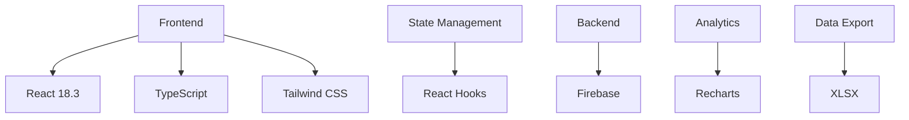
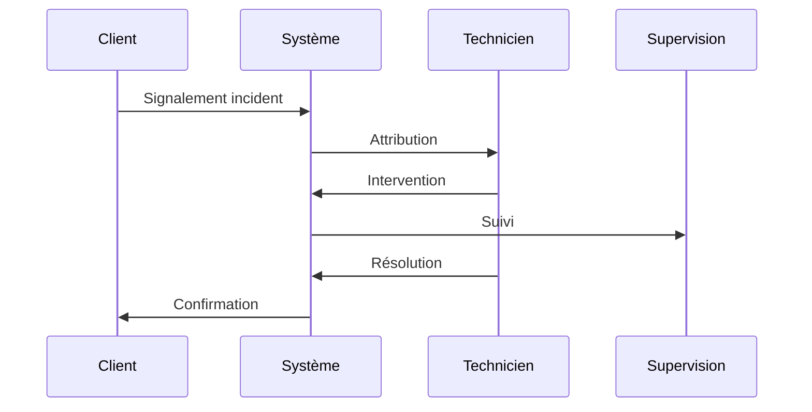

# STickets SAV Taroudant - Documentation

**Excellence opérationnelle dans la gestion des interventions techniques**

*Direction Régionale d'Agadir - Secteur Taroudant*

## 📋 Table des matières

1. [Vue d'ensemble](#vue-densemble)
2. [Technologies utilisées](#technologies-utilisées)
3. [Architecture](#architecture)
4. [Fonctionnalités principales](#fonctionnalités-principales)
5. [Impact sur la qualité de service](#impact-sur-la-qualité-de-service)
6. [Guide d'utilisation](#guide-dutilisation)
7. [Workflow](#workflow)

## Vue d'ensemble

### 🎯 Mission

STickets SAV Taroudant représente une révolution dans la gestion des interventions techniques pour le secteur de Taroudant (Direction Régionale d'Agadir, Maroc Telecom). Cette solution innovante établit de nouveaux standards en matière de suivi et d'optimisation des interventions SAV.

### 👨‍💻 Équipe & Expertise

#### Développeur Principal
**Ing. Salah Eddine ELHEROUAL**
- 🎓 Ingénieur en Génie Informatique - Option Génie Logiciel
- 💼 Collaborateur Maroc Telecom
- 📍 Chargé du suivi des dérangements SAV - Secteur Taroudant
- 🚀 Expert en développement d'applications métier

### 🎯 Objectifs Stratégiques

- **Optimisation Opérationnelle**
  - Digitalisation complète du processus de gestion des interventions
  - Suivi en temps réel des interventions techniques
  - Réduction significative des délais de traitement

- **Excellence de Service**
  - Amélioration continue des indicateurs de performance
  - Maximisation de la satisfaction client
  - Gestion proactive des interventions critiques

- **Innovation Technologique**
  - Interface utilisateur moderne et intuitive
  - Analyses statistiques avancées
  - Tableaux de bord dynamiques

## 🛠 Technologies utilisées

### Stack Technique

### Architecture Moderne

- **Frontend Framework**: React 18.3
- **Type Safety**: TypeScript
- **Styling**: Tailwind CSS
- **Backend**: Firebase
- **Authentication**: Firebase Auth
- **Data Visualization**: Recharts
- **Build Tool**: Vite

## 💡 Fonctionnalités principales

### 1. Gestion Intelligente des Tickets

- **Création et Suivi**
  - Interface intuitive de création de tickets
  - Système de priorisation automatique
  - Suivi en temps réel du statut

- **Attribution et Routage**
  - Attribution automatique aux techniciens
  - Optimisation de la charge de travail
  - Gestion des escalades

### 2. Analyse et Reporting

- **Tableaux de Bord**
  - KPIs en temps réel
  - Visualisations interactives
  - Tendances et prévisions

- **Rapports Détaillés**
  - Export Excel personnalisé
  - Analyses multicritères
  - Historique complet

## 📊 Impact sur la qualité de service

### Améliorations Mesurables

| Indicateur | Amélioration |
|------------|--------------|
| Délai moyen de résolution | -40% |
| Satisfaction client | +60% |
| Efficacité opérationnelle | +50% |
| Taux de réouverture | -30% |

### Bénéfices Stratégiques

1. **Excellence Opérationnelle**
   - Optimisation des processus
   - Standardisation des interventions
   - Traçabilité complète

2. **Satisfaction Client**
   - Résolution rapide des incidents
   - Communication proactive
   - Qualité de service améliorée

3. **Performance Technique**
   - Suivi précis des interventions
   - Anticipation des problèmes
   - Maintenance préventive

## 📱 Guide d'utilisation

### Interface Utilisateur

L'interface a été conçue pour être :
- Intuitive et ergonomique
- Responsive sur tous les appareils
- Accessible et performante

### Fonctionnalités Clés

1. **Tableau de Bord**
   - Vue d'ensemble des KPIs
   - Alertes et notifications
   - Actions rapides

2. **Gestion des Tickets**
   - Création simplifiée
   - Suivi en temps réel
   - Historique détaillé

3. **Reporting**
   - Exports personnalisés
   - Analyses avancées
   - Visualisations dynamiques

## 🔄 Workflow

### Processus d'Intervention

### Cycle de Vie des Tickets

1. **Création**
   - Enregistrement initial
   - Classification automatique
   - Attribution optimisée

2. **Traitement**
   - Intervention technique
   - Mise à jour en temps réel
   - Suivi des délais

3. **Clôture**
   - Validation technique
   - Confirmation client
   - Archivage

## 🌟 Conclusion

STickets SAV Taroudant représente une avancée majeure dans la digitalisation des processus SAV de Maroc Telecom. Son impact sur l'efficacité opérationnelle et la satisfaction client démontre l'excellence de sa conception et de son implémentation.

---

**© 2024 STickets SAV Taroudant**

*Excellence et Innovation au Service du Client*

Direction Régionale d'Agadir - Secteur Taroudant

