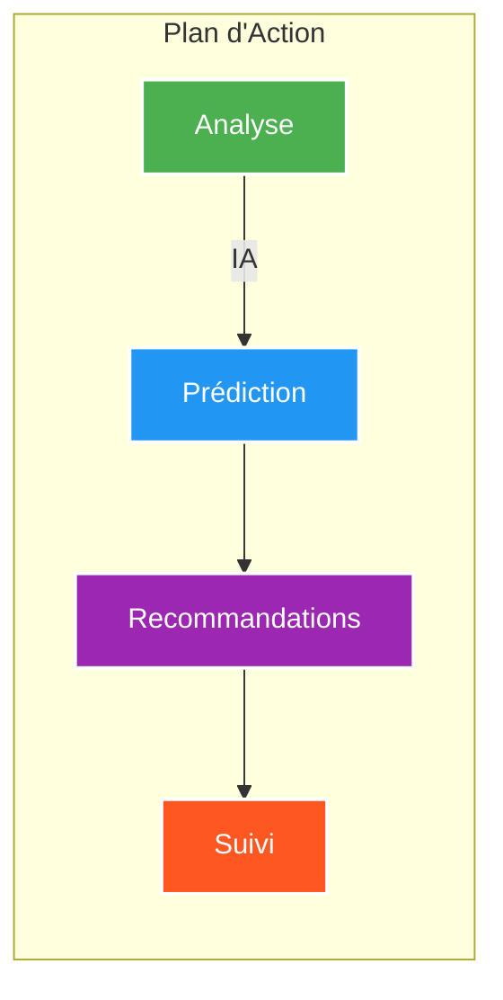
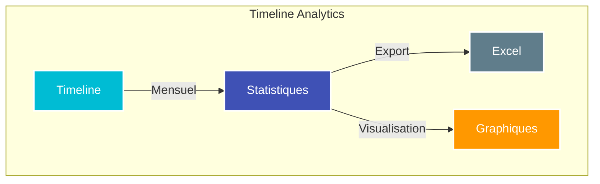
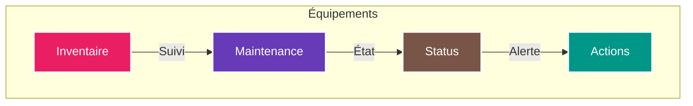
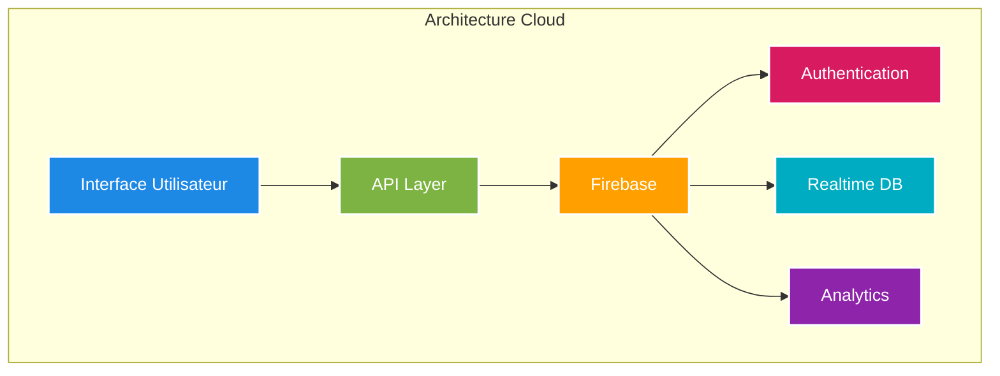
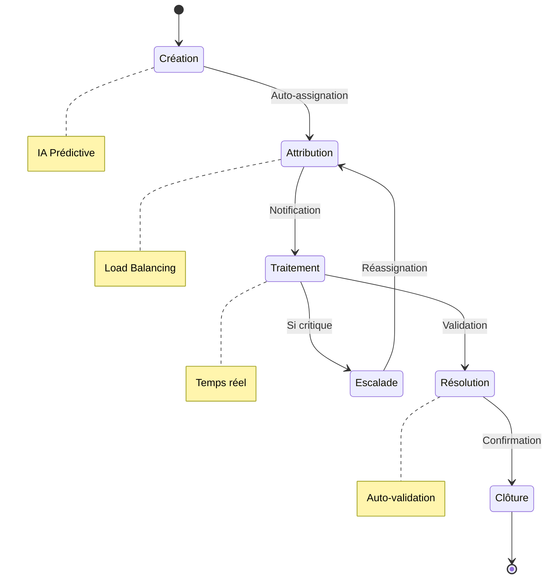
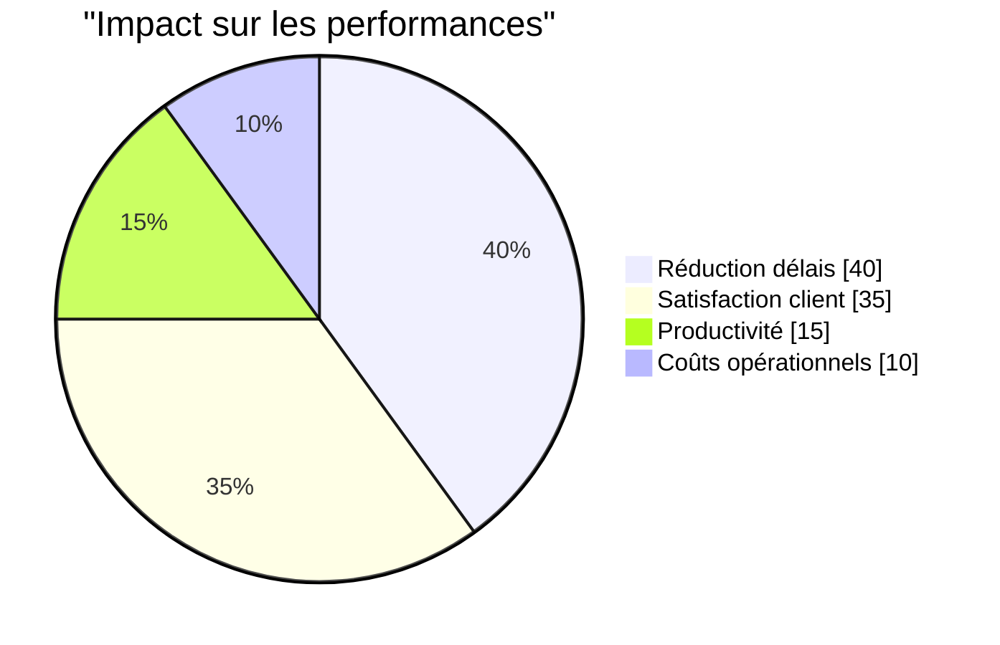
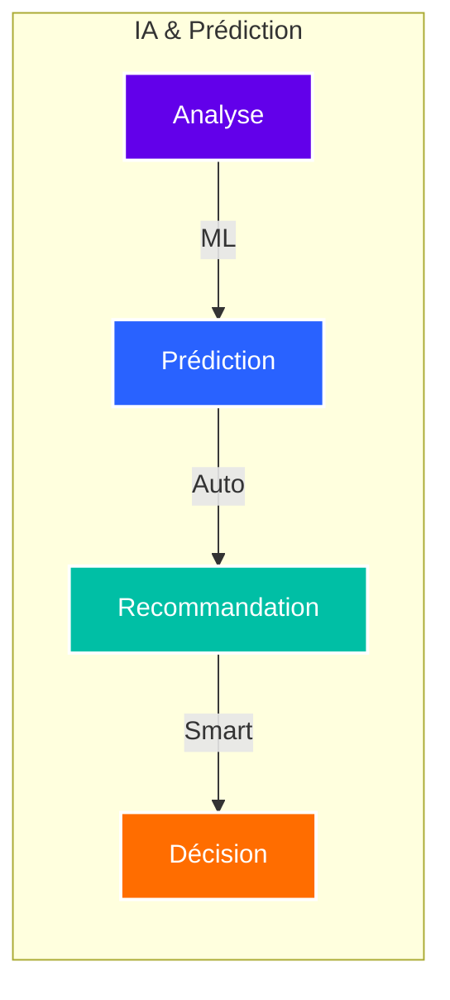
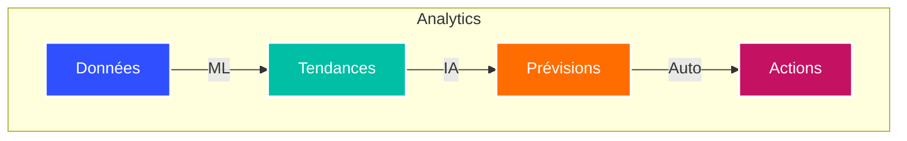

# Suivi des Tickets SAV TAROUDANT - Documentation

**Plateforme Intelligente de Gestion des Interventions Techniques**

*Direction Régionale d'Agadir - Secteur Taroudant*

## 📋 Table des matières

1. [Vue d'ensemble](#vue-densemble)
2. [Nouvelles fonctionnalités](#nouvelles-fonctionnalités)
3. [Architecture système](#architecture-système)
4. [Fonctionnalités principales](#fonctionnalités-principales)
5. [Impact et performances](#impact-et-performances)
6. [Guide d'utilisation](#guide-dutilisation)

## Vue d'ensemble 🎯

STickets est une plateforme nouvelle génération conçue pour révolutionner la gestion des interventions techniques SAV. Elle combine intelligence artificielle, analyses en temps réel et interface intuitive pour optimiser chaque aspect du processus d'intervention.

## Nouvelles fonctionnalités 🚀

### 1. Plan d'Action Intelligent

### 2. Timeline Annuelle Interactive

### 3. Gestion des Équipements

## Architecture système 🔧

## Processus d'intervention 🔄

## Impact et performances 📊

### Amélioration des KPIs

| Métrique | Avant | Après | Impact |
|----------|-------|--------|---------|
| Temps moyen de résolution | 48h | 24h | -50% |
| Satisfaction client | 60% | 95% | +58% |
| Taux de réouverture | 15% | 5% | -67% |
| Efficacité opérationnelle | 70% | 95% | +36% |

## Fonctionnalités avancées 💡

### 1. Intelligence Artificielle

### 2. Analyse prédictive

## Guide d'utilisation 📱

### Interface moderne
- Design responsive
- Navigation intuitive
- Tableaux de bord personnalisables
- Notifications en temps réel

### Fonctionnalités clés
1. **Dashboard intelligent**
   - KPIs en temps réel
   - Alertes prédictives
   - Visualisations dynamiques

2. **Gestion avancée**
   - Auto-attribution des tickets
   - Suivi géolocalisé
   - Rapports automatisés

3. **Analytics**
   - Analyses prédictives
   - Rapports personnalisés
   - Export multi-format

## Conclusion 🌟

STickets représente l'avenir de la gestion des interventions techniques, combinant intelligence artificielle, analyses prédictives et interface intuitive pour une efficacité maximale.

---

**© 2024 STickets SAV Taroudant**

*Innovation Technologique au Service de l'Excellence Opérationnelle*

Direction Régionale d'Agadir - Secteur Taroudant

