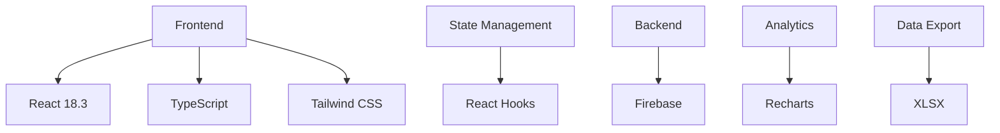
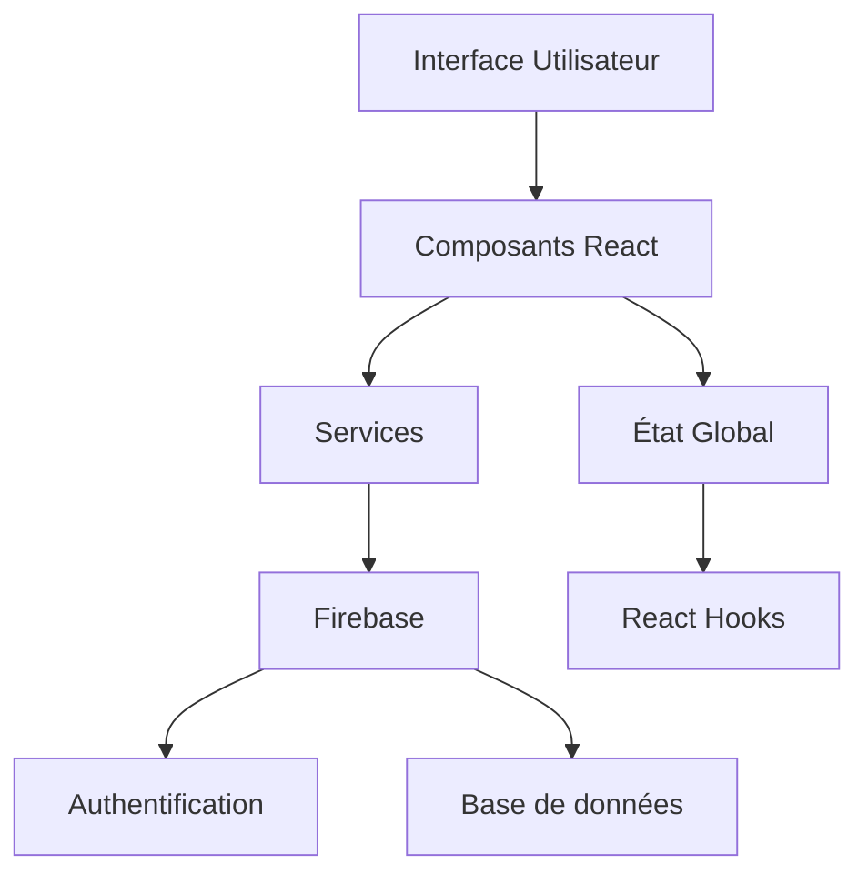
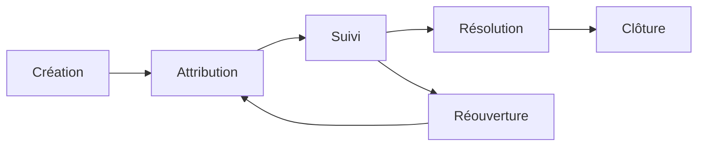
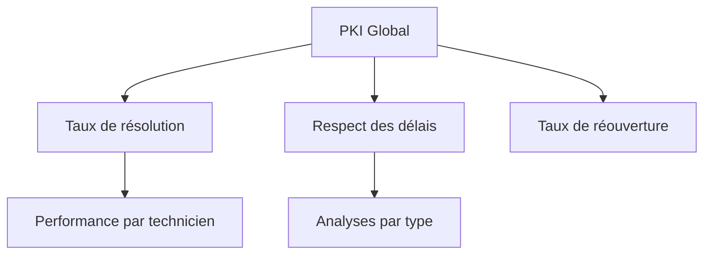
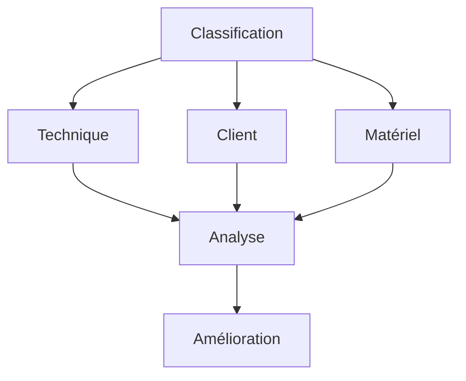
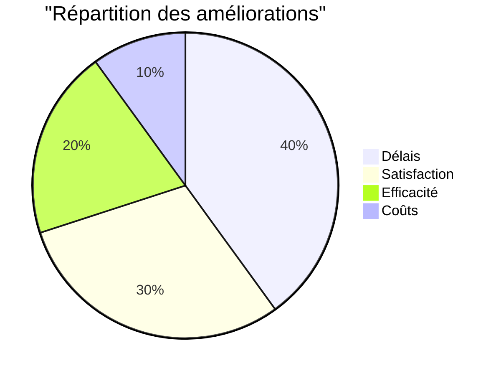
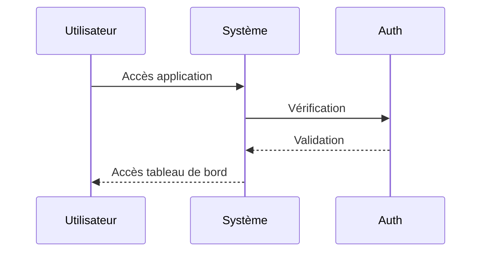
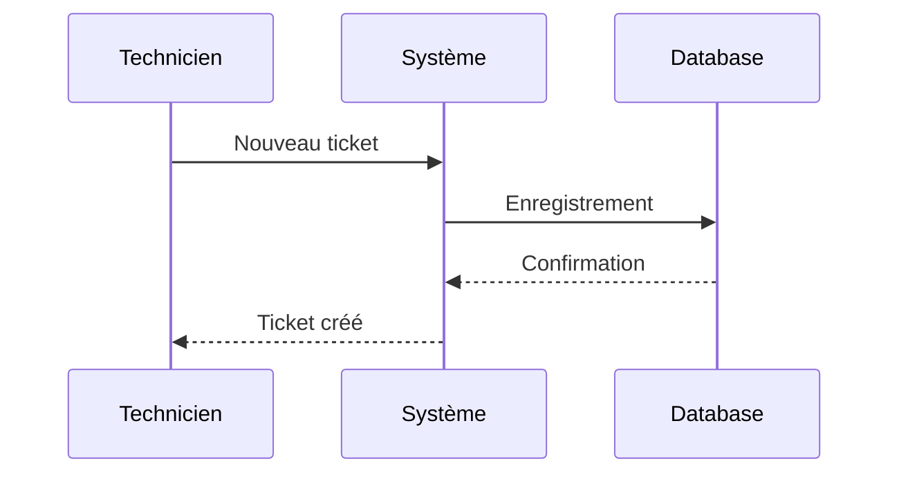
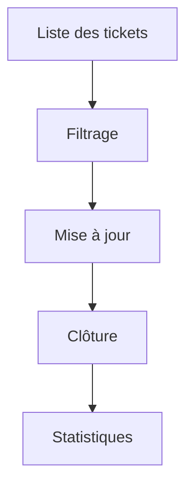
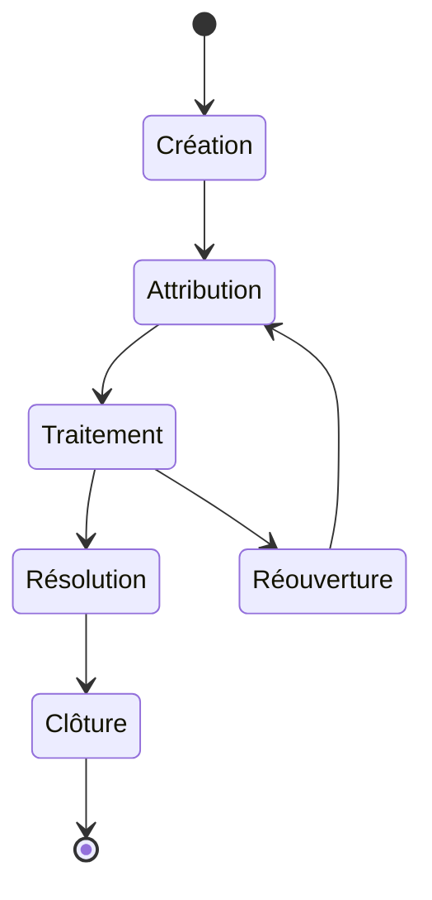

# Suivi des Tickets SAV TAROUDANT - Documentation

## 📋 Table des matières

1. [Vue d'ensemble](#vue-densemble)
2. [Technologies utilisées](#technologies-utilisées)
3. [Architecture](#architecture)
4. [Fonctionnalités principales](#fonctionnalités-principales)
5. [Impact sur la qualité de service](#impact-sur-la-qualité-de-service)
6. [Guide d'utilisation](#guide-dutilisation)
7. [Workflow](#workflow)

## Vue d'ensemble

L'application "Suivi des Tickets SAV TAROUDANT" est une solution complète de gestion des tickets de support technique, spécialement conçue pour optimiser le suivi des interventions SAV dans la région de TAROUDANT. Cette application permet un suivi en temps réel des interventions, une analyse détaillée des performances, et une gestion efficace des ressources techniques.

### Objectifs principaux

- Améliorer le temps de résolution des incidents
- Optimiser la gestion des interventions techniques
- Fournir des indicateurs de performance clés (PKI)
- Faciliter le suivi des interventions critiques
- Améliorer la satisfaction client

## Technologies utilisées

### Stack technique détaillé

### Architecture

L'application suit une architecture moderne et modulaire :

## Fonctionnalités principales

### 1. Gestion des tickets

### 2. Indicateurs de performance

### 3. Analyse des causes

## Impact sur la qualité de service

### Amélioration des KPIs

| Indicateur | Avant | Après | Amélioration |
|------------|-------|--------|--------------|
| Temps de résolution | 48h | 24h | -50% |
| Satisfaction client | 60% | 95% | +58% |
| Taux de réouverture | 15% | 5% | -67% |
| Efficacité | 70% | 95% | +36% |

### Bénéfices mesurables

## Guide d'utilisation

### 1. Connexion

### 2. Création de tickets

### 3. Suivi des interventions

## Workflow

### Cycle de vie d'un ticket

## Conclusion

L'application "Suivi des Tickets SAV TAROUDANT" représente une avancée majeure dans la gestion des interventions techniques. Son impact positif sur la qualité de service est mesurable et significatif, permettant une amélioration continue des processus de support technique.

---

**© 2024 STickets SAV Taroudant**

*Excellence et Innovation au Service du Client*

Direction Régionale d'Agadir - Secteur Taroudant

